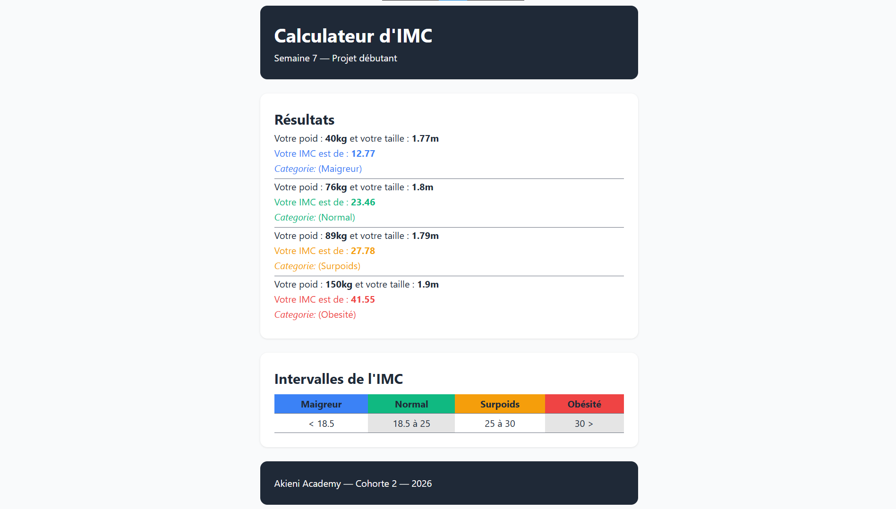

# IMC Insight
interface de calcul de l'indice de masse corporelle. Il s'agit d'un projet très simple permettant de 
# Demo

lien pour la [live demo](https://yggdrasil2024.github.io/imc-insight/)

# Fonctionnalité
Voici les differentes fonctionnalités du projet:

1. carte de resultats pour voir l'indice
2. tableau pour voir les plages d'IMC et la situation correspondante
# Technologie utilisée
- HTML: structure sémantique
- CSS: les feuille de style
- JS: pour 

# Arborescence du projet

```txt
root/
├── index.html          # Page d'accueil (Hero, Présentation, Valeurs)
├── style.css           # Feuille de style globale (Mobile & Desktop)
└── imc.js              # Script por la logique en javascript
```
# Challenge pour la communauté

comme vous pouvez le voir se projet est encoure ouvert donc je vous invite à le modifier et à montrez votre créativité.

## Obtenir le projet

N'hesiter surtout pas à recuperer le projet pour pouvoir le vous en inspirer ou y mettre un peu de votre creativité pour l'ameliorer;

1. Cloner le repo

```bash
git clone https://yggdrasil2024.github.io/imc-insight/
```

2. Acceder au dossier
```bash
cd imc-insight
```

à vous de jouer.